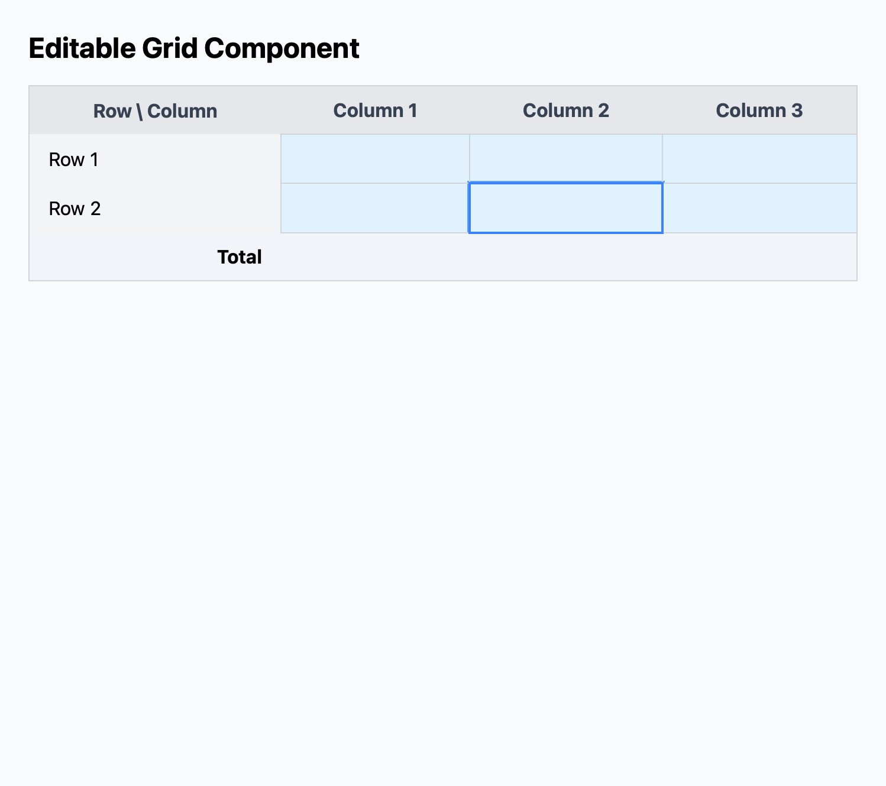
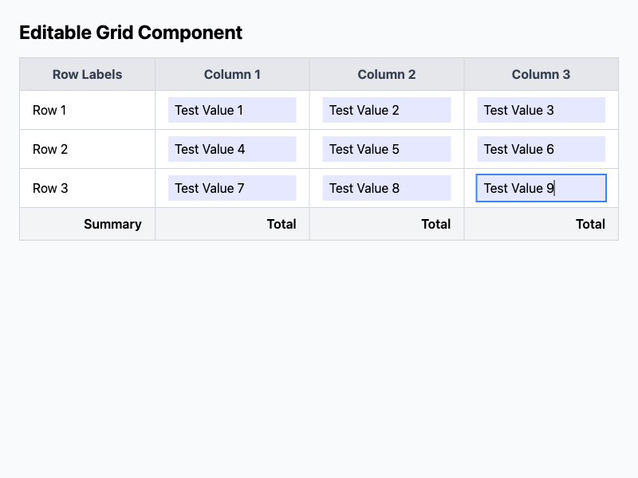
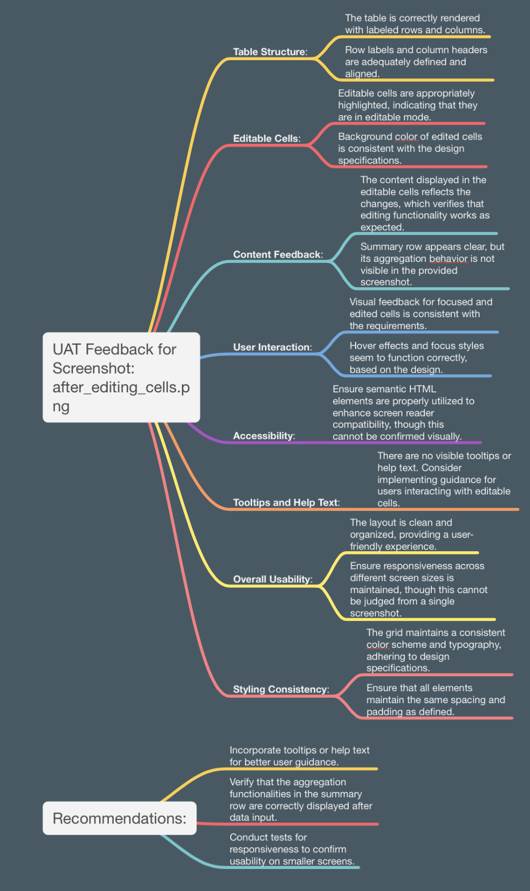

# ai_dev_workflow
Demonstration of AI generative HTML/JS programming capabilities.

## Explaination
### Step 1. Formal requirements are encoded as a JSON object:

```js 
const requirements = {
  project: "HTML-based Editable Grid Component",
  version: "1.0",
  overview: {
    description:
      "A web-based editable grid component designed to facilitate data input, editing, manipulation, and analysis within a web application. The component will be responsive, accessible, and optimized for both usability and performance, leveraging Tailwind CSS for styling.",
  },
  functional_requirements: {
    "FR-01": {
      title: "Table Structure",
      description: "Render a table with labeled rows and columns.",
      details: {
        rows: "Predefined row labels at the beginning of each row.",
        columns: "Predefined column labels at the top of the table.",
        content: "Remaining cells are editable.",
        styling: {
          responsive:
            "Use Tailwind CSS responsive utilities for screen-size adaptation.",
          focus: "Apply Tailwind focus utilities for keyboard navigation.",
        },
        accessibility:
          "Semantic HTML elements for better screen reader support.",
      },
    },
    "FR-02": {
      title: "Column Labels",
      description: "Include a set of predefined column labels.",
      details: {
        labels: "Column labels displayed in a left-aligned manner.",
        styling: {
          background:
            "Tailwind utilities to style the header row (e.g., bg-gray-200, text-gray-700).",
        },
      },
    },
    "FR-03": {
      title: "Row Labels",
      description: "Include a set of predefined row labels.",
      details: {
        labels: "Row labels displayed in a left-aligned manner.",
        styling: {
          background: "Tailwind utilities to style the first column.",
        },
      },
    },
    "FR-04": {
      title: "Editable Cells",
      description: "Allow cells within the table to be editable.",
      details: {
        behavior: "Cells editable by the user via contenteditable attribute.",
        visual_feedback: {
          default: "bg-indigo-50",
          focus: "focus:ring-2 focus:ring-blue-400",
          hover: "hover:bg-indigo-100",
        },
      },
    },
    "FR-05": {
      title: "Data Summarization and Aggregation",
      description: "Support aggregation functions applied to rows/columns.",
      details: {
        aggregation_functions: ["sum", "average", "count"],
        styling: {
          summary_row: "bg-gray-100 font-semibold",
          alignment: "text-right or text-center",
        },
      },
    },
    "FR-06": {
      title: "Dynamic Row and Column Manipulation",
      description:
        "Support dynamic addition, removal, and reordering of rows/columns.",
      details: {
        consistent_styling: "Ensure new rows/columns inherit existing styles.",
        transitions: {
          type: "Transition",
          classes: "transition ease-in-out duration-150",
        },
      },
    },
    "FR-07": {
      title: "Filtering and Sorting Capabilities",
      description: "Provide filtering and sorting options for the data.",
      details: {
        UI_controls:
          "Use Tailwind form controls for filters and sorting (e.g., form-select, form-input).",
        responsive_design:
          "Ensure filters are accessible on mobile devices using responsive classes.",
      },
    },
    "FR-08": {
      title: "Basic Data Validation and Formatting",
      description: "Include basic validation and formatting options.",
      details: {
        error_handling: "border-red-500 for errors, text-red-600 for messages.",
        success_indicators: "border-green-500 or text-green-600 for success.",
      },
    },
    "FR-09": {
      title: "Pivoting and Data Rearrangement",
      description: "Allow users to pivot data, rearranging rows and columns.",
      details: {
        seamless_transition: {
          type: "Animation",
          classes: "transition-all duration-200",
        },
        grid_flexibility:
          "Ensure dynamic grid layout using Tailwind's flexbox or grid utilities.",
      },
    },
    "FR-10": {
      title: "Styling and Usability",
      description: "Ensure the table is visually consistent and user-friendly.",
      details: {
        color_scheme:
          "Consistent colors using Tailwind utilities (e.g., text-gray-700, bg-gray-100).",
        typography:
          "Maintain good contrast and readability using Tailwind's typography utilities.",
        spacing: "Apply consistent spacing with px-4, py-2, and space-y-4.",
      },
    },
    "FR-11": {
      title: "Accessibility",
      description: "Ensure the table is accessible to users with disabilities.",
      details: {
        focus_management:
          "Apply focus:ring-2 and focus:ring-offset-2 to focused elements.",
        semantic_html:
          "Use semantic HTML elements for better screen reader support.",
      },
    },
    "FR-12": {
      title: "Usability Assistance",
      description:
        "Provide tooltips and help text to guide users on advanced features.",
      details: {
        tooltips:
          "Styled with Tailwind utilities (e.g., bg-black, text-white, rounded).",
        help_text:
          "Use text-sm, text-gray-600 for guidance below inputs or as tooltips.",
      },
    },
  },
  non_functional_requirements: {
    "NFR-01": {
      title: "Compatibility",
      description:
        "The component shall be compatible with modern web browsers.",
      details: {
        browsers: ["Chrome", "Firefox", "Safari", "Edge"],
        styling:
          "Tailwind CSS utilities for consistent styling across browsers.",
      },
    },
    "NFR-02": {
      title: "Performance",
      description:
        "The component shall load and be interactive within 2 seconds.",
      details: {
        optimization:
          "Use Tailwind's utility classes for efficient styling and layout rendering.",
      },
    },
    "NFR-03": {
      title: "Scalability",
      description: "The component shall handle large datasets efficiently.",
      details: {
        data_handling:
          "Leverage in-memory data structures and optimized algorithms for large datasets.",
      },
    },
    "NFR-04": {
      title: "Integration",
      description:
        "The component shall integrate seamlessly with backend systems.",
      details: {
        APIs: "Provide hooks for data import/export and interaction with backend services.",
      },
    },
  },
  assumptions: {
    "A-01":
      "The table structure (rows and columns) is predefined but can be dynamically modified by the user.",
    "A-02":
      "The editable grid will be integrated into a broader web application where advanced data validation and backend integration will be handled.",
  },
  constraints: {
    "C-01":
      "The grid component is designed for environments with JavaScript enabled.",
    "C-02":
      "The grid component provides basic validation and formatting, with complex validation handled by the application layer.",
  },
};
```
### Step 2. Requirements are used to generate HTML/CSS/JS

HTML component is generated using GPT:



### Step 3. Code for automating HTML/CSS/JS testing is generated

Test automation code for HTML component generated using GPT:

```js 
// the test function must be an async arrow function. The logger and outputDir are available as a global variable.
(async () => {
    // Launch the browser
    const browser = await puppeteer.launch();
    const page = await browser.newPage();

    const fileUrl = `file://${outputDir}/index.html`;
    
    // Load the local HTML file
    await page.goto(fileUrl, { waitUntil: 'networkidle0' });
    
    // Screenshot the page and save it as output.png
    await page.screenshot({ path: `${outputDir}/output.png` });

    // Close the browser
    await browser.close();
})();%  
```




### Step 4. 
User Acceptance Testing of HTML component is peformed using OpenAI vision API:




## Instructions
### Run script
run `node grid_component.mjs` 

### Observe output
in output directory

## Caution
If you are a software developer, and you automate all software development, then you will probably eventually be fired by your own software.

